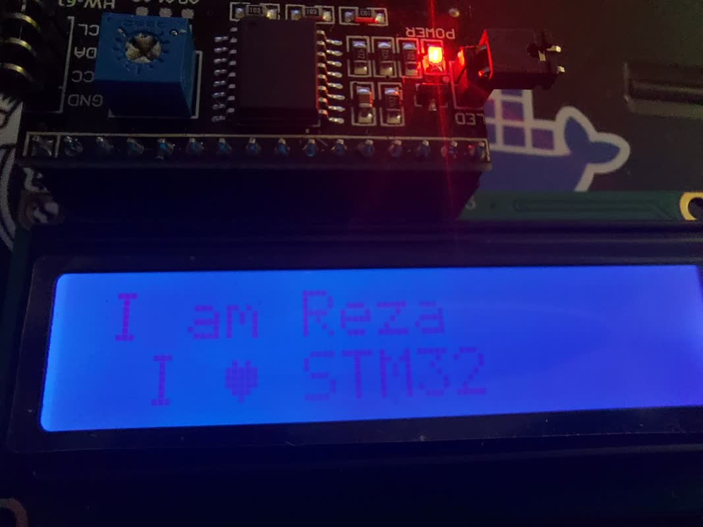

```html
<!DOCTYPE html>
<html lang="fa">
<head>
  <meta charset="UTF-8">
  <title>کتابخانه LCD I2C برای STM32</title>
  <style>
    body { font-family: Tahoma, sans-serif; direction: rtl; background: #f5f5f5; color: #333; padding: 20px; }
    h1, h2 { color: #0d47a1; }
    pre { background: #eee; padding: 10px; border-radius: 5px; overflow-x: auto; }
    table { border-collapse: collapse; width: 100%; margin-top: 10px; }
    th, td { border: 1px solid #aaa; padding: 8px; text-align: center; }
    img { max-width: 100%; }
  </style>
</head>
<body>

<h1>📟 کتابخانه LCD I2C برای STM32</h1>
<p>کتابخانه‌ای حرفه‌ای و قابل تنظیم برای نمایش متن، اعداد و شکل‌های دلخواه روی LCD های کاراکتری از طریق رابط I2C</p>

<h2>📦 ویژگی‌ها</h2>
<ul>
  <li>نمایش رشته، عدد صحیح و اعشاری</li>
  <li>کاراکترهای سفارشی</li>
  <li>اسکرول ساده، چرخشی و رفت‌وبرگشتی</li>
  <li>بدون نیاز به تغییر در HAL</li>
</ul>

<h2>⚙️ توابع کتابخانه</h2>
<table>
  <tr><th>تابع</th><th>توضیح</th></tr>
  <tr><td>LCD_Init()</td><td>مقداردهی اولیه</td></tr>
  <tr><td>LCD_Clear()</td><td>پاک‌سازی نمایشگر</td></tr>
  <tr><td>LCD_SetCursor(row, col)</td><td>تنظیم مکان‌نما</td></tr>
  <tr><td>LCD_Print("text")</td><td>نمایش متن</td></tr>
  <tr><td>LCD_PrintInt(num)</td><td>نمایش عدد صحیح</td></tr>
  <tr><td>LCD_PrintFloat(val, dp)</td><td>نمایش عدد اعشاری</td></tr>
  <tr><td>LCD_CreateChar(loc, map[])</td><td>ساخت کاراکتر دلخواه</td></tr>
  <tr><td>LCD_ScrollText(...)</td><td>اسکرول متن</td></tr>
</table>

<h2>🧪 پیش‌نیازها</h2>
<ul>
  <li>فعالسازی I2C در STM32CubeMX</li>
  <li>تعریف متغیر global به‌صورت: <code>extern I2C_HandleTypeDef hi2c1;</code></li>
</ul>

<h2>📸 تصویر پروژه</h2>


<h2>📄 لایسنس</h2>
<p>MIT License © Reza Ahmadi</p>

</body>
</html>